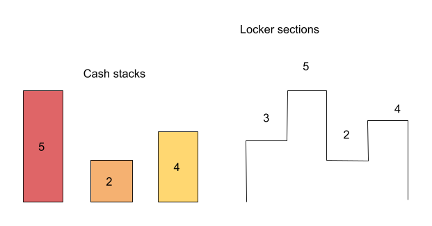
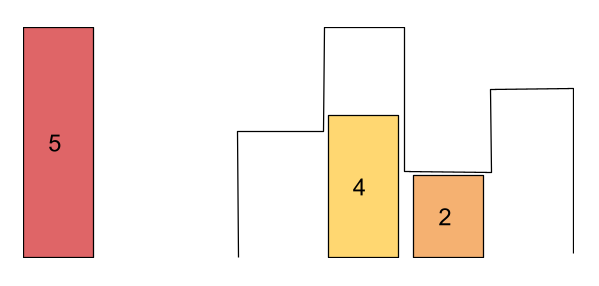
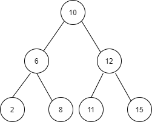

# DAILY CODING JOURNAL

This repository contains my daily coding practice questions and solutions. It covers various topics, including data structures, algorithms, problem-solving techniques, and Java programming patterns.

## 📌 Contents

- **Java Programs** (Basic to Advanced)
- **Data Structures & Algorithms**
- **Competitive Coding Questions**
- **Pattern Printing Programs**
- **Logical & Mathematical Problems**

## 📜 Menu (Problem List)
Below is a list of all the problems. Click on any problem to jump to its statement.

| Problem No. | Problem Name | Solution |
|-------------|-------------|----------|
| [Problem 1](#problem-1-ninja-and-locker) | **Ninja and Locker** | [Java](./Solutions%20in%20JAVA/Ninja_And_Locker.java)| 
| [Problem 2](#problem-2) | **Combine Two Tables** | [SQL](./SQL/combine-two-tables.sql)  |
| [Problem 3](#problem-3) | **Check For Dead End In A BST** | [Java](./Solutions%20in%20JAVA/CheckForDeadEnd_In_BST.java)  |
| [Problem 4](#problem-4) | **Longest Route** | [CPP](./Solutions%20in%20CPP/Arrays/longestPath.cpp)|
| [Problem 5](#problem-5) | **Merge Point of Two Linked Lists**| [JAVA](./Solutions%20in%20JAVA/MergePointOfList.java)|
| [Problem 6](#problem-6)| **Binary strings with no consecutive 1s**| [CPP](./Solutions%20in%20CPP/Recursion%20&%20DP/Noconsecutive1Binary.cpp) |
| [Problem 7](#problem-7)| **Flip given bits**| [CPP](./Solutions%20in%20CPP/Arrays/flibBits.cpp)|


## 🚀 How to Use

1. Clone the repository:
   ```bash
   git clone https://github.com/kokkondaBhanuteja/Daily-Coding-Journal.git
   ```


## ✨ Contributions
This repository is primarily for personal practice, but feel free to fork it and use it for your own learning. If you have suggestions, open an issue!

## 📢 Stay Connected
   -   [GitHub](https://github.com/kokkondaBhanuteja)
   -   [LinkedIn](https://www.linkedin.com/in/kokkonda-bhanu-teja-73a7b7214/)
   -   [Email me](mailto:bhanutejakokkonda@gmail.com)


## Happy Coding! 🎯🚀

## Problem-1 (Ninja and Locker)
   ### Statement
   ```sh
   Ninja has two arrays ‘CASH’’ and ‘LOCKER’ denoting the height of each stack of cash of unit width and height of ‘N’ sections in the locker respectively.

   The locker sections are labeled from 0 to ‘N’ - 1 from left to right.

   Cash stacks can only be put in the locker by following the certain rules:

   Cash stacks can’t be piled up
   You can take any order of cash stack
   You can push the stack in the locker only from left to right
   If height of some stack is greater than the height of locker section then the stack will be stopped before that room
   Ninja wants your help to find the maximum number of cash stacks he can put into the locker.
   ```
    
   
   
   ### [SOLUTION](./Solutions%20in%20JAVA/Ninja_And_Locker.java)


## Problem-2
   ### Statement
   ```sh
   Table: Person

+-------------+---------+
| Column Name | Type    |
+-------------+---------+
| PersonId    | int     |
| FirstName   | varchar |
| LastName    | varchar |
+-------------+---------+
PersonId is the primary key column for this table.
Table: Address

+-------------+---------+
| Column Name | Type    |
+-------------+---------+
| AddressId   | int     |
| PersonId    | int     |
| City        | varchar |
| State       | varchar |
+-------------+---------+
AddressId is the primary key column for this table.


Write a SQL query for a report that provides the following 
information for each person in the Person table, regardless if there is an address for each of those people:

FirstName, LastName, City, State
   ```
   ### [SOLUTION](./SQL/combine-two-tables.sql)


## Problem-3
   ### Statement
   ```sh
   You are given a Binary Search Tree (BST) that contains positive integers only. 
   Your task is to find out whether the BST contains a Dead End. A BST is said to have a Dead End if there exists a leaf node in the BST,
   for which it is impossible to insert any further nodes after that node in that BST. If such nodes do not exist, then the BST doesn’t contain a Dead End.

   A binary search tree (BST), also called an ordered or sorted binary tree, is a rooted binary tree whose internal nodes 
   each store a value greater than all the values in the node's left subtree and less than those in its right subtree.
   ```
   ```sh
      Sample Input 1 :
         1
         10 6 12 2 8 11 15 -1 -1 -1 -1 -1 -1 -1 -1
         Sample Output 1 :
         True
   ```
   
   ### [SOLUTION](./Solutions%20in%20JAVA/CheckForDeadEnd_In_BST.java)


## Problem-4
   ### Statement
      You are given a 2-D binary matrix "Mat" of dimensions N x M consisting only of 0s and 1s. The cell consisting of 0 means that the cell is blocked and it cannot be visited 
      whereas a cell with 1 as a value means it can be visited.
      You are given a source cell and a destination cell. You need to find the length of the longest possible path from source to destination, given you can only move in 
      4 possible directions north(i.e from (i,j) to (i-1,j)), south(i.e from (i,j) to (i+1,j)), east(i.e from (i,j) to (i,j-1)), and west(i.e from (i,j) to (i,j+1)), and without visiting a cell twice.
      
   ### [SOLUTION](./Solutions%20in%20CPP/Arrays/longestPath.cpp)

## Problem-5
   ### Statement
   ```sh
   Given two singly linked lists, 'FIRST_HEAD' and 'SECOND_HEAD'. Your task is to find the 'MERGING POINT' i.e. the data of the node at which merging starts. If there is no merging, return -1.
   ```
   
   ### [SOLUTION](./Solutions%20in%20JAVA/MergePointOfList.java)

## Problem-6
   ### Statement
   ```sh
   You have been given an integer 'N'. Your task is to generate and return all binary strings of length 'N' such that,
   there are no consecutive 1's in the string.
   A binary string is that string which contains only ‘0’ and ‘1’.
   
   For Example:
   Let ‘N'=3, hence the length of the binary string would be 3. 
   We can have the following binary strings with no consecutive 1s:
   000 001 010 100 101 
   ```
   ### [SOLUTION](./Solutions%20in%20CPP/Recursion%20&%20DP/Noconsecutive1Binary.cpp)

## Problem-7
   ### Statement 
   ```sh
   You have been given an integer 'NUM' (32 bits) and an array of size 'N'.
   Your task is to flip all the bits of 'NUM' at position 'ARR[i]' where 0<= i <= N-1.
   Sample Input 1:
   3
   4 2 1
   21
   Sample Output 1:
   30
   Explanation for Sample Input 1:
   Before flipping
   21 => 10101
   After flipping the 4th, 2nd and 1st bit from the end we get 
   30 => 11110
   ```
   ### [SOLUTION](./Solutions%20in%20CPP/Arrays/flibBits.cpp)
