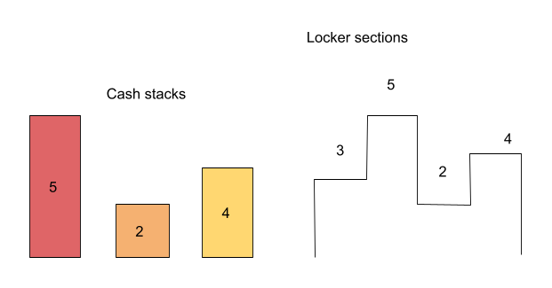
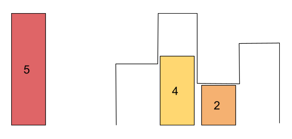
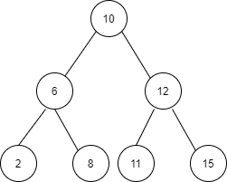
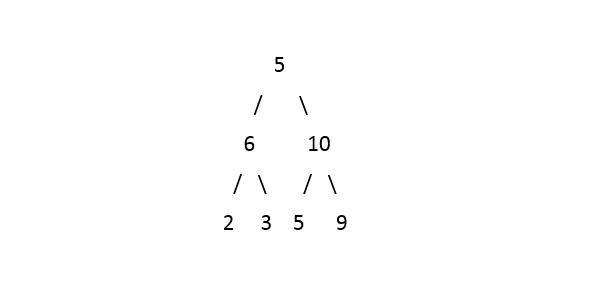
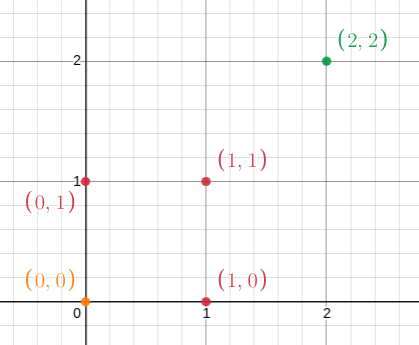
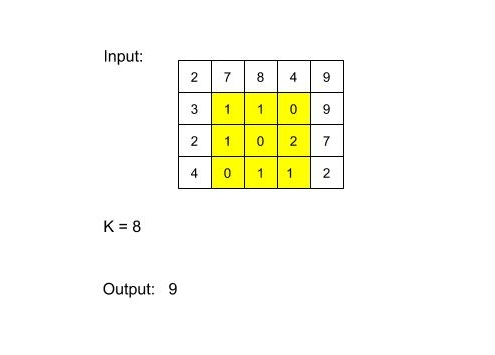
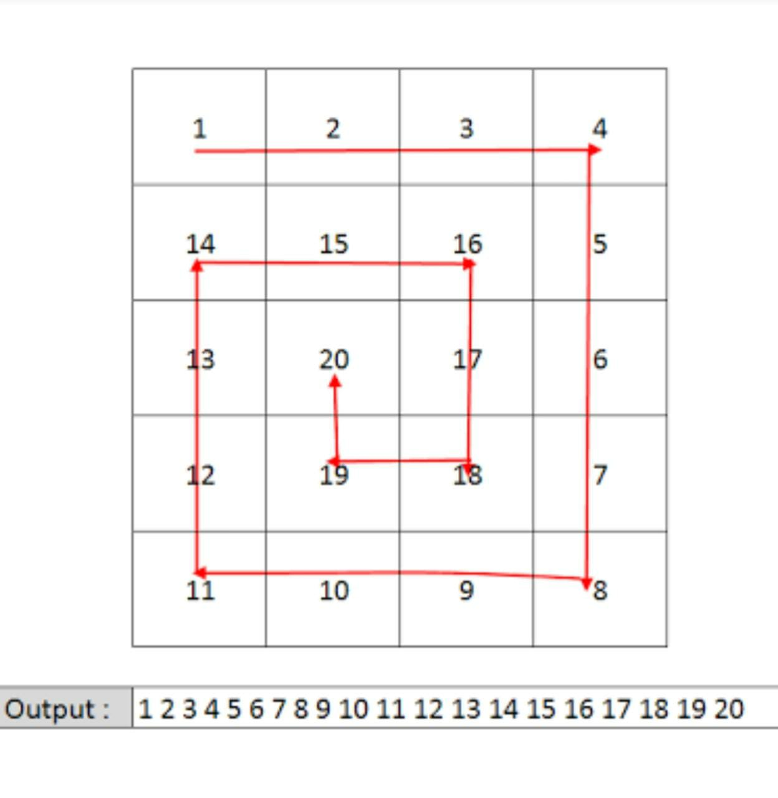

# DAILY CODING JOURNAL

This repository contains my daily coding practice questions and solutions. It covers various topics, including data structures, algorithms, problem-solving techniques, and Java programming patterns.

## 📌 Contents

- **Java Programs** (Basic to Advanced)
- **Data Structures & Algorithms**
- **Competitive Coding Questions**
- **Pattern Printing Programs**
- **Logical & Mathematical Problems**

## 📜 Menu (Problem List)
Below is a list of all the problems. Click on any problem to jump to its statement.

| Problem No. | Problem Name | Solution |
|-------------|-------------|----------|
| [Problem 1](#problem-1-ninja-and-locker) | **Ninja and Locker** | [Java](./Solutions%20in%20JAVA/Ninja_And_Locker.java)| 
| [Problem 2](#problem-2) | **Combine Two Tables** | [SQL](./SQL/combine-two-tables.sql)  |
| [Problem 3](#problem-3) | **Check For Dead End In A BST** | [Java](./Solutions%20in%20JAVA/CheckForDeadEnd_In_BST.java)  |
| [Problem 4](#problem-4) | **Longest Route** | [CPP](./Solutions%20in%20CPP/Arrays/longestPath.cpp)|
| [Problem 5](#problem-5) | **Merge Point of Two Linked Lists**| [JAVA](./Solutions%20in%20JAVA/MergePointOfList.java)|
| [Problem 6](#problem-6)| **Binary strings with no consecutive 1s**| [CPP](./Solutions%20in%20CPP/Recursion%20&%20DP/Noconsecutive1Binary.cpp) |
| [Problem 7](#problem-7)| **Flip given bits**| [CPP](./Solutions%20in%20CPP/Arrays/flibBits.cpp)|
| [Problem 8](#problem-8)|**Prime Permutations**|[CPP](./Solutions%20in%20CPP/Numbers%20&%20MATH/PrimePermutation.cpp)|
| [Problem 9](#problem-9)|**Largest Number in Binary Tree**|[CPP](./Solutions%20in%20CPP/Trees/LargestNumber.cpp) [JAVA](./Solutions%20in%20JAVA/trees/PrintLargest.java)|
| [Problem 10](#problem-10)| **Election Result**| [JAVA](./Solutions%20in%20JAVA/Strings/ElectionResult.java)|
| [Problem 11](#problem-11)|**Custom Sort String**|[JAVA](./Solutions%20in%20JAVA/Strings/CustomSortString.java)|
| [Problem 12](#problem-12)|**Fastest Ninja**|[JAVA](./Solutions%20in%20JAVA/Matrices/FastestNinja.java)|
| [Problem 13](#problem-13)|**Clone a binary tree with random pointers**|[JAVA](./Solutions%20in%20JAVA/trees/CloneBinaryTreeRandomPointers.java)|
| [Problem 14](#problem-14)|**Longest Substring With K Distinct Characters**|[JAVA](./Solutions%20in%20JAVA/Strings/Longest_Substring_With_K_Distinct_Characters.java)|
| [Problem 15](#problem-15) | **Square Submatrix with sum less than or equal to K** | [JAVA](./Solutions%20in%20JAVA/Matrices/BigSquareSum.java) |
| [Problem 16](#problem-16) | **ATOI (String to Integer Conversion)** | [JAVA](./Solutions%20in%20JAVA/Strings/AtoI.java) |
| [Problem 17](#problem-17)|**Good Number**|[JAVA](./Solutions%20in%20JAVA/GoodNumber.java)|
| [Problem 18](#problem-18)|**Hills and Soldiers**|[JAVA](./Solutions%20in%20JAVA/List/HillsandSoldier.java)|
| [Problem 19](#problem-19)| **Tic-Tac-Toe**|[JAVA](./Solutions%20in%20JAVA/Matrices/TicTacToe.java)|
| [Problem 20](#problem-20)|**The Hero Test-2**|[CPP](./Solutions%20in%20CPP/Arrays/heroTest.cpp) &nbsp;&nbsp; [JAVA](./Solutions%20in%20JAVA/List/HeroTest_2.java)|
| [Problem 21](#problem-21)|**Convert To Lower Case**|[CPP](./Solutions%20in%20CPP/strings/convert_to_lowerCase.cpp)&nbsp;&nbsp;[JAVA](./Solutions%20in%20JAVA/Strings/ConvertToLowerCase.java)|
| [Problem 22](#problem-22)|**Find K Pairs with Smallest Sums**|[JAVA](./Solutions%20in%20JAVA/List/FindK_SmallestPairs.java)|
| [Problem 23](#problem-23)|**Circular Tour**|[CPP](./Solutions%20in%20CPP/Arrays/CircularTour.cpp)|
| [Problem 24](#problem-24)|**Program to check the validity of a Password**|[JAVA](./Solutions%20in%20JAVA/Strings/CheckValidityOfPassword.java)|
| [Problem 25](#problem-25)|**Reverse DLL nodes in groups**|[JAVA](./Solutions%20in%20JAVA/List/ReverseDLL_in_Groups.java)|
| [Problem 26](#problem-26)|**Longest Mountain Subarray**|[JAVA](./Solutions%20in%20JAVA/List/LongestMountainSubArray.java)|
| [Problem 27](#problem-27)|**Longest Repeating Substring**|[JAVA](./Solutions%20in%20JAVA/Strings/LongestRepeatString.java)|
| [Problem 28](#problem-28)|**Maximum Points From Cards**|[JAVA](./Solutions%20in%20JAVA/List/MaximumPointsFromCards.java)|
| [Problem 29](#problem-29)|**Spiral Matrix**|[JAVA](./Solutions%20in%20JAVA/Matrices/SpiralMatrix.java)|
| [Problem 30](#problem-30)|**Max Difference in a Bianry String**|[JAVA](./Solutions%20in%20JAVA/List/MaxDifference.java)|
| [Problem 31](#problem-31)|**Print the Kth Digit**|[JAVA](./Solutions%20in%20JAVA/List/KthDigit.java)|
| [Problem 32](#problem-32)|**Anagram Substring Search**|[JAVA](./Solutions%20in%20JAVA/Strings/AnagramIndicesFinder.java)|
| [Problem 33](#problem-33)|**Anagram Substring Search**|[JAVA](.)|
| [Problem 34](#problem-34)|**Anagram Substring Search**|[JAVA](.)|


## 🚀 How to Use

1. Clone the repository:
   ```bash
   git clone https://github.com/kokkondaBhanuteja/Daily-Coding-Journal.git
   ```


## ✨ Contributions
This repository is primarily for personal practice, but feel free to fork it and use it for your own learning. If you have suggestions, open an issue!

## 📢 Stay Connected
   -   [GitHub](https://github.com/kokkondaBhanuteja)
   -   [LinkedIn](https://www.linkedin.com/in/kokkonda-bhanu-teja-73a7b7214/)
   -   [Email me](mailto:bhanutejakokkonda@gmail.com)


## Happy Coding! 🎯🚀

## Problem-1 (Ninja and Locker)
   ### Statement
   ```sh
   Ninja has two arrays ‘CASH’’ and ‘LOCKER’ denoting the height of each stack of cash of unit width and height of ‘N’ sections in the locker respectively.

   The locker sections are labeled from 0 to ‘N’ - 1 from left to right.

   Cash stacks can only be put in the locker by following the certain rules:

   Cash stacks can’t be piled up
   You can take any order of cash stack
   You can push the stack in the locker only from left to right
   If height of some stack is greater than the height of locker section then the stack will be stopped before that room
   Ninja wants your help to find the maximum number of cash stacks he can put into the locker.
   ```
    
   
   
   ### [SOLUTION](./Solutions%20in%20JAVA/Ninja_And_Locker.java)&nbsp;&nbsp;&nbsp;&nbsp;  [BACK](#daily-coding-journal)


## Problem-2
   ### Statement
   ```sh
   Table: Person

+-------------+---------+
| Column Name | Type    |
+-------------+---------+
| PersonId    | int     |
| FirstName   | varchar |
| LastName    | varchar |
+-------------+---------+
PersonId is the primary key column for this table.
Table: Address

+-------------+---------+
| Column Name | Type    |
+-------------+---------+
| AddressId   | int     |
| PersonId    | int     |
| City        | varchar |
| State       | varchar |
+-------------+---------+
AddressId is the primary key column for this table.


Write a SQL query for a report that provides the following 
information for each person in the Person table, regardless if there is an address for each of those people:

FirstName, LastName, City, State
   ```
   ### [SOLUTION](./SQL/combine-two-tables.sql)&nbsp;&nbsp;&nbsp;&nbsp;  [BACK](#daily-coding-journal)


## Problem-3
   ### Statement
   ```sh
   You are given a Binary Search Tree (BST) that contains positive integers only. 
   Your task is to find out whether the BST contains a Dead End. A BST is said to have a Dead End if there exists a leaf node in the BST,
   for which it is impossible to insert any further nodes after that node in that BST. If such nodes do not exist, then the BST doesn’t contain a Dead End.

   A binary search tree (BST), also called an ordered or sorted binary tree, is a rooted binary tree whose internal nodes 
   each store a value greater than all the values in the node's left subtree and less than those in its right subtree.
   ```
   ```sh
      Sample Input 1 :
         1
         10 6 12 2 8 11 15 -1 -1 -1 -1 -1 -1 -1 -1
         Sample Output 1 :
         True
   ```
   
   ### [SOLUTION](./Solutions%20in%20JAVA/CheckForDeadEnd_In_BST.java)&nbsp;&nbsp;&nbsp;&nbsp;  [BACK](#daily-coding-journal)


## Problem-4
   ### Statement
      You are given a 2-D binary matrix "Mat" of dimensions N x M consisting only of 0s and 1s. The cell consisting of 0 means that the cell is blocked and it cannot be visited 
      whereas a cell with 1 as a value means it can be visited.
      You are given a source cell and a destination cell. You need to find the length of the longest possible path from source to destination, given you can only move in 
      4 possible directions north(i.e from (i,j) to (i-1,j)), south(i.e from (i,j) to (i+1,j)), east(i.e from (i,j) to (i,j-1)), and west(i.e from (i,j) to (i,j+1)), and without visiting a cell twice.
      
   ### [SOLUTION](./Solutions%20in%20CPP/Arrays/longestPath.cpp)&nbsp;&nbsp;&nbsp;&nbsp;  [BACK](#daily-coding-journal)

## Problem-5
   ### Statement
   ```sh
   Given two singly linked lists, 'FIRST_HEAD' and 'SECOND_HEAD'. Your task is to find the 'MERGING POINT' i.e. the data of the node at which merging starts. If there is no merging, return -1.
   ```
   
   ### [SOLUTION](./Solutions%20in%20JAVA/MergePointOfList.java)&nbsp;&nbsp;&nbsp;&nbsp;  [BACK](#daily-coding-journal)

## Problem-6
   ### Statement
   ```sh
   You have been given an integer 'N'. Your task is to generate and return all binary strings of length 'N' such that,
   there are no consecutive 1's in the string.
   A binary string is that string which contains only ‘0’ and ‘1’.
   
   For Example:
   Let ‘N'=3, hence the length of the binary string would be 3. 
   We can have the following binary strings with no consecutive 1s:
   000 001 010 100 101 
   ```
   ### [SOLUTION](./Solutions%20in%20CPP/Recursion%20&%20DP/Noconsecutive1Binary.cpp)&nbsp;&nbsp;&nbsp;&nbsp;  [BACK](#daily-coding-journal)

## Problem-7
   ### Statement 
   ```sh
   You have been given an integer 'NUM' (32 bits) and an array of size 'N'.
   Your task is to flip all the bits of 'NUM' at position 'ARR[i]' where 0<= i <= N-1.
   Sample Input 1:
   3
   4 2 1
   21
   Sample Output 1:
   30
   Explanation for Sample Input 1:
   Before flipping
   21 => 10101
   After flipping the 4th, 2nd and 1st bit from the end we get 
   30 => 11110
   ```
   ### [SOLUTION](./Solutions%20in%20CPP/Arrays/flibBits.cpp)&nbsp;&nbsp;&nbsp;&nbsp;  [BACK](#daily-coding-journal)


## Problem-8
   ### Statement
   ```sh
   You are given an integer, ‘N’. Your task is to determine the total number of different permutations of the numbers from 1 to ‘N’, such that in every such permutation, all prime numbers within the range, 1 to ‘N’ are present at prime indices(1-indexed), and composite numbers at composite indices.

   Note:
   1. The permutation [1,4,3,2] is not a valid permutation because 2 is a prime number and thus it should be placed at a prime index but in this permutation, it is placed at index 4(1-indexed). Also, at index 2, a prime number should have been placed as 2 is a prime number but here, 4 is placed which is not a prime number. So, this is an invalid permutation.

   2. The permutation [1,3,2,4] is a valid permutation because 2 and 3 are prime numbers, so index 2 and index 3 are prime indices. In this permutation, prime numbers are placed at prime indices only and composite numbers are placed at composite indices so this is a valid permutation.
   ```
   ### [SOLUTION](./Solutions%20in%20CPP/Numbers%20&%20MATH/PrimePermutation.cpp)&nbsp;&nbsp;&nbsp;&nbsp;  [BACK](#daily-coding-journal)

## Problem-9
   ### Statement
   ```sh
   You have been given a Binary Tree of 'N' nodes where the nodes have integer values.
   Your task is to find the largest number that could be formed by concatenating all its nodes values.
   ```
   **For example:**
   For the given binary tree:   
   
  ### Output: 96553210    
   Explanation: After concatenating all the numbers in the above binary tree
   this is the largest number that can be formed. 
   ### [SOLUTION](./Solutions%20in%20CPP/Trees/LargestNumber.cpp)&nbsp;&nbsp;&nbsp;&nbsp;  [BACK](#daily-coding-journal)

## Problem-10
   ## Statement
   ```sh
   Elections are going on, and there are two candidates A and B, contesting with each other. 
   There is a queue of voters and in this queue, some of them are supporters of A and some of them are supporters of B. 
   Many of them are neutral. The fate of the election will be decided on which side the neutral voters vote. Supporters of A and supporters of B make attempts to win the votes of neutral voters.

   The way this can be done is explained below:

   1. The voter queue is denoted by three characters, viz {-, A, B}. The ‘-’ denotes neutral candidate,
    ‘A’ denotes supporter of candidate A and ‘B’ denotes supporter of candidate B.
   2. Supporters of A can only move towards the left side of the queue.
   3. Supporters of B can only move towards the right side of the queue.
   4. Since time is critical, supporters of both A and B will move simultaneously.
   5. They both will try and influence the neutral voters by moving in their direction in the queue. If a supporter of A reaches the neutral voter before a supporter of B reaches him, 
   then that neutral voter will become a supporter of candidate A.
   6. Similarly, if a supporter of B reaches the neutral voter before supporter of A reaches him, then that neutral voter will become a supporter of candidate B.
   7. Finally, if both reach at the same time, the voter will remain neutral. A neutral vote cannot decide the outcome of the election.
   8. If finally, the queue has more votes for candidate A, then A wins the election. If B has more votes, then B wins that election. If both have equal votes, then it will be a coalition government.
   Your task is to find the outcome of the election.
   ```
   ### [SOLUTION](./Solutions%20in%20JAVA/Strings/ElectionResult.java)&nbsp;&nbsp;&nbsp;&nbsp;  [BACK](#daily-coding-journal)

## Problem-11
   ### Statement
   ```sh
   You are provided with the two strings named X and Y respectively. Y has its own specific order and has no repeating characters. Your task is to arrange the characters of the first string i.e. X in such a way that the order of characters in X is exactly the same as in Y, which means if ‘d’ occurs after ‘c’ in Y then it should also occur after ‘c’ in X ( obviously if X has ‘d’ and ‘c’ as characters in it ). All you have to do is, convert string X in the specific order with respect to string Y.

   Note :

   Both the strings have only lowercase English alphabets. 
   There may be more than one correct solution, you have to return any one of the possible solutions.
   ```
   ### [SOLUTION](./Solutions%20in%20JAVA/Strings/CustomSortString.java)&nbsp;&nbsp;&nbsp;&nbsp;  [BACK](#daily-coding-journal)

## Problem-12
   ### Statement
   ```sh
   After the pandemic ended, Alice and Bob finally got the chance to play some outdoor games. They decided to play “Fastest Ninja” along with their ‘N’ other friends. The game is as follows,

1. Bob and Alice are standing at coordinates (0, 0) and (‘X’, ‘Y’), respectively, in the X-Y plane.

2. All the other ‘N’ friends are standing at some coordinates in the X-Y plane. The starting positions of all the ‘N’ friends are given as a 2 - Dimensional array of integers ‘positions’, where ‘position[i]’ denotes the starting position of the i-th friend.

3. In one move, Bob and his ‘N’ friends can independently choose to do one of the following two things:

    1. Stay at their current position.

    2. Move to any of the four neighboring positions, i.e., for any (x, y) move to north(x, y + 1), south(x, y - 1), east(x + 1, y), or west(x - 1, y).
To win the game, Bob has to reach Alice before any of his ‘N’ friends catches him. As Bob’s friend, your task is to tell him whether he can win the game or not.

Note:
All the coordinates are integral coordinates on the X-Y plane

There can be multiple friends with the same starting position(including Alice and Bob).

Bob and his ‘N’ friends move simultaneously.

Bob loses if he reaches any coordinate(including Alice’s position) at the same time as any of his ‘N’ friends.
   ```
```sh
 Sample Input 1: 
   3  #no of friends
   2 2 # alice coordinates (in the image the alice coordinate  is marked in green color)
   0 1 ## friends Coordinates
   1 0
   1 1
```

### [SOLUTION](./Solutions%20in%20JAVA/Matrices/FastestNinja.java)&nbsp;&nbsp;&nbsp;&nbsp;  [BACK](#daily-coding-journal)


## Problem-13
   ### Statement  
   ```sh
   You are given a binary tree. Apart from the left and right child pointers, each node in the given binary tree points to a random node in the given binary tree. You are supposed to return a clone of the binary tree.
   Cloning a binary tree means making a deep copy of the input binary tree.

   Note :
   Two nodes may have the same value associated with them.
   The root node will be fixed and will be provided in the function.
   ```
   ### [SOLUTION](./Solutions%20in%20JAVA/trees/CloneBinaryTreeRandomPointers.java)&nbsp;&nbsp;&nbsp;&nbsp;  [BACK](#daily-coding-journal)

## Problem-14
   ### Statement 
   ```sh
   You are given a string 'S' of length 'N' consisting of lowercase English alphabet letters. 
   You are also given a positive integer 'K'.
   Now, a substring of this string is good if it contains at most 'K' distinct characters.
   A string 'X' is a substring of string 'Y' if it can be obtained by deletion of several continuous elements(possibly zero) 
   from the beginning and the end from the string 'Y'.

   Your task is to return the maximum size of any good substring of the string 'S'.

   Example:
   ‘S’ = “bacda” and ‘K’ = 3.

   ```
   ### [SOLUTION](./Solutions%20in%20JAVA/Strings/Longest_Substring_With_K_Distinct_Characters.java)&nbsp;&nbsp;&nbsp;&nbsp;  [BACK](#daily-coding-journal)

## Problem-15
   ### Statement
   ```sh
   Given a 2-dimensional matrix of size ‘N’ x ‘M’ and an integer K. Find the size of the largest square sub-matrix ,
   whose sum is less than or equal to K. The size of a matrix is the product of rows and columns in it.
   A sub-matrix is a matrix obtained from the given matrix by deletion of several (possibly, zero or all) 
   rows/columns from the beginning and several (possibly, zero or all) rows/columns from the end. 
   A square matrix is a matrix which has the same number of rows and columns.
   ```
   
   
   ### [SOLUTION](./Solutions%20in%20JAVA/Matrices/BigSquareSum.java)&nbsp;&nbsp;&nbsp;&nbsp;  [BACK](#daily-coding-journal)
## Problem-16
   ### Statement
   ```sh
   Given a string s, the objective is to convert it into integer format without utilizing any built-in functions. 
   ```
   ### [SOLUTION](./Solutions%20in%20JAVA/Strings/AtoI.java)&nbsp;&nbsp;&nbsp;&nbsp;  [BACK](#daily-coding-journal)
## Problem-17
   ### Statement
   ```sh
   You are given an integer ‘N’, you need to find whether it’s a good number or not.

We start from the integer ‘N’ and keep replacing the current number with the sum of squares of its digits, we keep repeating this process until we will the number 1. A number that generates the 1 after finite repetition of the above process is called a good number.

Example :
If ‘N’ = 7,

Then we start with the integer 7 and replace it with (7 * 7) = 49.
The new number is 49, we replace it with (4 * 4) + (9 * 9) = 97.
We replace this new number 97 with (9 * 9) + (7 * 7) = 130.
We replace this new number 130 with (1 * 1) + (3 * 3) + (0 * 0) = 10.
We replace this new number 10 with (1 * 1) + (0 * 0) = 1.

Therefore, the original number 7 is a good number. 
   ```
   ### [SOLUTION](./Solutions%20in%20JAVA/GoodNumber.java)&nbsp;&nbsp;&nbsp;&nbsp;  [BACK](#daily-coding-journal)

## Problem-18
   ### Statement
   ```sh
   In old times when there was no direct communication channel present, for the security of kingdoms and to convey the danger to the kingdom the soldier used to fire light torches on the hills, and the soldier on other hills could watch those light torches and used to get the message.

A soldier can watch the torch of another hill if there is no hill between them that is higher than any of the two hills.

You are given an array of size ‘N’ representing the heights of the hill in order by the name ‘HILLS’ and you have to tell the number of pairs of soldiers who can see the torch of each other.

For a pair, (a, b) is same as (b, a).
   ```
   ### [SOLUTION](./Solutions%20in%20JAVA/List/HillsandSoldier.java) &nbsp;&nbsp;&nbsp;&nbsp;  [BACK](#daily-coding-journal)


## Problem-19
   ### Statement
   ```sh
   Two players, named ‘player1’ and ‘player2’, play a tic-tac-toe game on a grid of size ‘3 x 3’. Given an array ‘moves’ of size ‘n’, where each element of the array is a tuple of the form (row, column) representing a position on the grid. Players place their characters alternatively in the sequence of positions given in ‘moves’. Consider that ‘player1’ makes the first move. Your task is to return the winner of the game, i.e., the winning player’s name. If there is no winner and some positions remain unmarked, return ‘uncertain’. Otherwise, the game ends in a draw, i.e., when all positions are marked without any winner, return ‘draw’.

The rules of tic-tac-toe are as follows :

1. At the start of the game, all grid positions are empty.

2. The players take turns to place their characters alternatively into empty positions. ‘player1’ always places character ‘X’ and ‘player2’ always places character ‘O’.

3. A player will never place characters into filled positions.

4. The game ends when all the positions are filled.

5. The game also ends when any row, column, or diagonal contains three same characters (i.e., either ‘X’ or ‘O’). In this case, the winner is the player whose character occupies these three positions.

6. Once the game ends, no more moves are played.
   ```
   ### [SOLUTION](./Solutions%20in%20JAVA/Matrices/TicTacToe.java) &nbsp;&nbsp;&nbsp; [BACK](#daily-coding-journal)


## Problem-20
   ### Statement
   ```sh
   After passing hero test 1 with flying colours, now Ninja gets a different exam to get promoted to the hero class S.

   Here also the pattern is the same as the previous exam, Ninja will get ‘N’ questions from 1 to ‘N’ but this time Ninja comes with a new technique to order the questions, he will solve a question after skipping ‘K’ questions (assume that after ‘N’th question he will come back to the first question) until he completes all questions.

   Help Ninja by telling him the order of questions that is always a permutation of 1 to ‘N’.
   ```
   ```sh
   For EXAMPLE: 
      If the number of questions is ‘5’ and ‘K’ = 3 
      Then the order will be
      “4 3 5 2 1”
   ```
   ### [SOLUTION](./Solutions%20in%20JAVA/List/HeroTest_2.java) &nbsp;&nbsp;&nbsp; [BACK](#daily-coding-journal) 

## Problem-21
   ### Statement
   ```sh
   You are given a string ‘str’, your task is to convert all the characters of the string into lowercase letters.

For example:
   You are given, ‘str’ = ‘AbcdEfgh’, in this string if you convert all the characters into lowercase, the string will be  ‘abcdefgg’. Hence it is the answer.
```
   ### [SOLUTION](./Solutions%20in%20JAVA/Strings/ConvertToLowerCase.java) &nbsp;&nbsp; [BACK](#daily-coding-journal)


## Problem-22
   ### Statement
   ```sh
   You are given two arrays of positive integers say ‘arr1’ and ‘arr2’ and a positive integer ‘K’.
   Also ‘arr1’ and ‘arr2’ are already sorted in ascending order. Consider all pairs (x, y) such that ‘x’ belongs to ‘arr1’ and ‘y’ belongs to ‘arr2’. You need to find exactly ‘K’ such pairs with the smallest sum of ‘x’ and ‘y’.

   Example:

      Let ‘arr1’ be [ ‘1’, ‘2’, ‘6’ ] and ‘arr2’ be [ ‘3’, ‘3’, ‘5’ ] and ‘K’ be 3.

      There are 9 possible (x, y) pairs such that ‘x’ belongs to ‘arr1’ and ‘y’ belongs to ‘arr2’.
       Among all of them 3 pairs with smaller ‘x’ + ‘y’ are [ (1, 3), (1, 3), (2, 3) ].
   ```
   ### [SOLUTION](./Solutions%20in%20JAVA/List/FindK_SmallestPairs.java) &nbsp;&nbsp;&nbsp; [BACK](#daily-coding-journal)

## Problem-23
   ### Statement
   ```sh
   You have been given a circular path. There are N petrol pumps on this path that are numbered from 0 to N - 1 (Both inclusive). Each petrol pump has two values associated with it:

1)The amount of petrol that is available at this particular petrol pump.

2)The distance to reach the next petrol pump.

You are on a truck having an empty tank of infinite capacity. You can start the tour from any of the petrol pumps. Your task is to calculate the first petrol pump from where the truck will be able to complete the full circle or determine if it is impossible to do so.

You may assume that the truck will stop at every petrol pump and it will add the petrol from that pump to its tank. The truck will move one kilometre for each litre of petrol consumed.
   ```
   [SOLUTION](./Solutions%20in%20CPP/Arrays/CircularTour.cpp) &nbsp;&nbsp;&nbsp; [BACK](#daily-coding-journal)

## Problem-24
   ### Statement
   ```sh
   Ninjas are trying to hack a system of a terrorist organization so that they can know where they will be going to attack next. But to hack the system and to get access to data they need a password that must satisfy certain conditions as described below:

1) Length of the password must be between 8 to 15 characters.
2) At least one digit (0-9), one lowercase letter (a-z), one uppercase letter (A-Z) and one special character (%, ^, &, #, *, %, etc) must be present.
3) Password must not contain any space.
You are given a string ‘STR’, help ninjas to find whether it's a valid password or not.
   ```
   ### [SOLUTION](./Solutions%20in%20JAVA/Strings/CheckValidityOfPassword.java) &nbsp;&nbsp;&nbsp; [BACK](#daily-coding-journal)

## Problem-25
   ### Statement
   ```sh
   You are given a Doubly Linked List of integers and a positive integer 'K' representing the group size. Modify the linked list by reversing every group of 'K' nodes in the linked list.

A doubly linked list is a type of linked list that is bidirectional, that is, it can be traversed in both directions, forward and backward. 
Note:
If the number of nodes in the list or in the last group is less than K, just reverse the remaining nodes. 
   ```
   ### [SOLUTION](./Solutions%20in%20JAVA/List/ReverseDLL_in_Groups.java)&nbsp;&nbsp;&nbsp; [BACK](#daily-coding-journal)

## Problem-26
   ### Statement
   ```sh
   You are given an array of 'N' integers denoting the heights of the mountains. You need to find the length of the longest subarray which has the shape of a mountain.

A mountain subarray is defined as a subarray which consists of elements that are initially in ascending order until a peak element is reached and beyond the peak element all other elements of the subarray are in decreasing order.

Example:
If the given array is: [1 3 1 4]. The longest mountain subarray would be 3. This is because the longest mountain is  [1 3 1] having length 3.
   ```
   ### [SOLUTION](./Solutions%20in%20JAVA/List/LongestMountainSubArray.java) &nbsp;&nbsp;&nbsp; [BACK](#daily-coding-journal)

## Problem-27
   ### Statement
   ```sh
   You are given a string 'str' of length 'N'. You can perform at most 'k' operations on this string. In one operation, 
   you can choose any character of the string and change it to any other uppercase English alphabet character.

   Return the length of the longest substring containing same characters after performing the above operations.
   ```
   ### [SOLUTION](./Solutions%20in%20JAVA/Strings/LongestRepeatString.java) &nbsp;&nbsp;&nbsp; [BACK](#daily-coding-journal)

## Problem-28
   ### Statement
   ```sh
   Given an array 'arr' of size 'N' representing the points associated with each card, and an integer 'K' representing the number of cards to be taken.
   We need to return the maximum score that can be obtained.
   In each step, we can choose to take one card from either the beginning or the end of the row.
   We must take exactly ‘K’ cards. The score is calculated as the sum of the points of the cards chosen.
   ```
   ### [SOLUTION](./Solutions%20in%20JAVA/List/MaximumPointsFromCards.java) &nbsp;&nbsp;&nbsp; [BACK](#daily-coding-journal)

## Problem-29
   ### Statement
   ```sh
   You are given a 2-D array 'MATRIX' of dimensions N x M, of integers. You need to return the spiral path of the matrix.
   ```
   

   ### [SOLUTION](./Solutions%20in%20JAVA/Matrices/SpiralMatrix.java) &nbsp;&nbsp;&nbsp; [BACK](#daily-coding-journal)

## Problem-30
   ### Statement
   ```sh
   You are given a binary string. You are supposed to find the maximum difference between the number of zeros(0's) and the number of ones(1's) in any substring of the given string.

Note:
Binary String is a string that consists of only ‘0’s and ‘1’s.

A string ‘A’ is said to be a substring of string ‘B’ if ‘A’ can be obtained by deleting several characters(possibly none) from the start of ‘B’ and by deleting several characters(possibly none) from the end of ‘B’.

The substring must have a length greater than or equal to 1.
   ```
   ### [SOLUTION](./Solutions%20in%20JAVA/List/MaxDifference.java) &nbsp;&nbsp;&nbsp; [BACK](#daily-coding-journal)

## Problem-31
   ### Statement
   ```sh
      You are given three non-negative integers N, M, and K. Your task is to print the Kth digit from the right in ‘N’ raised to the power ‘M’ that is, in N ^ M.

   Note:

   1) It is guaranteed that the Kth digit from the right always exists.
   2) It is also guaranteed that 'K' is always less than or equal to the number of digits in N ^ M.
   3) 'N' and 'M 'can’t be a 0 simultaneously.
   ```
   ### [SOLUTION](./Solutions%20in%20JAVA/List/KthDigit.java) &nbsp;&nbsp;&nbsp; [BACK](#daily-coding-journal)

## Problem-32
   ### Statement
   ```sh
   Given two strings ‘STR’ and ‘PTR’. Find all the starting indices of ‘PTR’ anagram substring in ‘STR’. Two strings are anagram if and only if one string can be converted into another string by rearranging the character.

For example, ‘ABCD’ and ‘ACBD’ are two anagram strings because ‘ACBD’ can be converted into ‘ABCD’ by rearranging the ‘B’ and ‘C’. ’ABA’ and ‘ABB’ are not anagram because we can’t convert ‘ABA’ to ‘ABB’ by rearranging the characters of particular strings.

‘ABACD’ and ‘CABAD’ are anagram because ‘ABACD’ can be converted into ‘CABAD’ by rearranging the first ‘A’ with ‘C’ and second ‘A’ with ‘B’.
   ```
   ### [SOLUTION](./Solutions%20in%20JAVA/Strings/AnagramIndicesFinder.java) &nbsp;&nbsp;&nbsp; [BACK](#daily-coding-journal)
 
## Problem-33
   ### Statement
   ```sh
   You are given two binary search trees of integers having ‘N’ and ‘M’ nodes. Return an array that contains elements of both BST in sorted order.


A binary search tree (BST) is a binary tree data structure with the following properties.

• The left subtree of a node contains only nodes with data less than the node’s data.

• The right subtree of a node contains only nodes with data greater than the node’s data.

• Both the left and right subtrees must also be binary search trees.
   ```
   ### [SOLUTION](./Solutions%20in%20JAVA/trees/MergeBST.java)&nbsp;&nbsp;&nbsp; [BACK](#daily-coding-journal)

## Problem-34
   ### Statement
   ```sh
   You are given a binary string ‘STR’, containing only zeroes and ones. This string does not contain any leading zero.

   Your task is to determine if this string contains at most one contiguous segment of ones.
   ```
   ### [SOLUTION](./Solutions%20in%20JAVA/Strings/OneSegment.java)&nbsp;&nbsp;&nbsp; [BACK](#daily-coding-journal)
